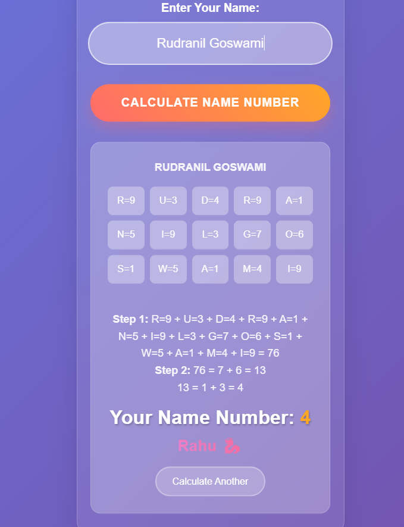
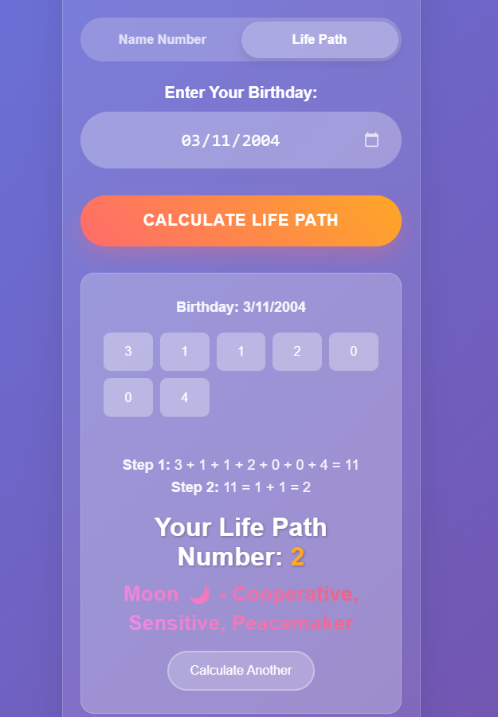

<h1 align="center">🔮 Numerology Calculator 🔢</h1>
<p align="center">Discover your cosmic connection through the power of numbers</p>

<p align="center">
  
  
  
</p>

<p align="center">
  
</p>

---

## ✨ About the Project

**Numerology Calculator** is a visually stunning and intuitive web app that reveals hidden meanings behind your **Name** and **Birthdate** using numerology principles. It uses custom numerology mappings and step-by-step breakdowns to give users insight into their **Name Number** and **Life Path Number**.

---

## ⚙️ Features

- 🔢 **Name Number Calculation**  
  Convert your name into numbers and reduce to a single-digit numerology value using a custom chart.

- 🧭 **Life Path Number Calculation**  
  Use your birthdate to uncover your path and purpose in life.

- ✨ **Modern UI/UX**  
  Styled with glassmorphism, gradient buttons, and smooth layouts.

- 📱 **Responsive Design**  
  Fully compatible on mobile, tablet, and desktop.

---

## 🧮 How It Works

### 🔡 Name Number

> Based on a Pythagorean numerology chart:

| Letter | Value |
|--------|--------|
| A, J, S | 1 |
| B, K, T | 2 |
| C, L, U | 3 |
| D, M, V | 4 |
| E, N, W | 5 |
| F, O, X | 6 |
| G, P, Y | 7 |
| H, Q, Z | 8 |
| I, R   | 9 |

Steps:
1. Sum the values of all letters in your name.
2. Reduce to a single digit.

### 🎂 Life Path Number

> Based on your full birthdate.

Steps:
1. Add all digits of your birth date (DD/MM/YYYY).
2. Reduce to a single digit.

---

## 📸 Screenshots

| Name Number | Life Path |
|-------------|-----------|
|  |  |

---

## 🚀 Getting Started

### 📦 Prerequisites

- Python 3.x
- Web Framework: Flask (or basic HTML/CSS/js)
- Optional: JavaScript for web version

### 🛠️ Installation

```bash
git clone https://github.com/your-username/numerology-calculator.git
cd numerology-calculator
